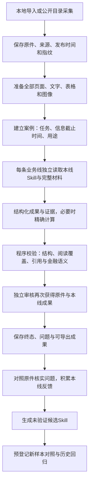

# 架构与处理边界

系统以完整原件为共同证据，以各线Skill规定方法。共享资料不会使不同业务线共享执行对话；审核通过新的模型请求独立开展。当前为单机文件存储，不需要数据库或专用调度服务。

## 原件到结果

Luna整理本次发现的完整目录清单，不能增删链接或依据标题排除某条业务线。脚本只执行来源边界、下载、格式和完整性检查。取得原件后，各条已选业务线阅读全文再判断适用性，不使用目录摘要代替原文。

## 七条独立业务线

| ID | 业务 | 主要输入与结果 |
|---|---|---|
| `extraction` | 数据结构化提取 | 公告、扫描件、复杂表格；输出字段、口径、原值及证据 |
| `financial-report` | 财务报告分析 | 财报、附注、经营披露；分析经营、利润、现金与财务质量 |
| `industry-chain` | 产业链影响分析 | 公司与产业材料；分析关系、供需及影响传导条件 |
| `valuation` | 估值建模 | 完整财务、经营假设、资本结构及定价输入；形成可核查的情景计算 |
| `report-factcheck` | 研报事实核查 | 待核查报告与原始证据；逐项判断主张并给出修改依据 |
| `investment-memo` | 投资备忘录 | 公司、产业及估值材料；组织论点、反证、风险与跟踪事项 |
| `research-quality` | 研究质量评估 | 待评研究稿与相关原件；评价证据、逻辑、完整性与研究边界 |

每线有业务Skill、审核规范和评价标准。单份经营公告通常只支持部分任务；缺少财报、行情、研报或附件时，应保留 `needs_data`，不能补造数字或结论。`not_applicable` 只能是完整阅读后的业务判断，未读或材料准备失败不是“不适用”。

## 程序承担的工作

- `collection`、`cninfo`、`ingestion_queue`：有界目录发现、公开下载、清单复用和技术去重。
- `documents`、`storage`：原件指纹、完整页面准备、案例、资料组、发布时间和文件保存。
- `provider`、`runner`：接口调用、独立角色输入、Decimal计算、输出校验和运行终态。
- `feedback_review`、`evaluation`、`experiments`：问题核实、可比性与分区检查、候选试验和版本决策。
- `pipeline`、`campaign`、`lifecycle`：单份流程、有限连续批次、进程状态与显式恢复。
- `web`、`cli`：本机工作台和命令入口，共用资料库写锁。

`resources/skills/` 与 `resources/reviews/` 保存方法；`web/` 保存界面；使用者自己的原件、案例、结果和日志运行后写入本地资料库。运行记录可能包含完整原文、模型输入和接口元数据，不属于公开发布内容。

## 改进与防退化

业务执行、独立审核、问题核实及候选生成使用分开的请求。审核提出的问题先对照原件核实，再进入反馈库；机器核实标记为未经专家校准。候选生成默认要求同一业务线至少3个独立材料组的合格反馈，每份自动批次最多尝试1个候选。这是积累节奏，不是质量阈值。

新旧版本必须在预登记的新验证材料上对照，并接受独立历史回归。开发资料、同组原件和已经用于调优的验证组不能改名后充当未见样本。失败与不确定项保留，不能仅靠平均分掩盖退化。

默认 `promotion_policy.enabled=false`。生成候选不会改写稳定Skill，连续批次也不自动把后续原件切入验证区或执行晋升。具体比较规则见 [评价与版本管理](evaluation.md)。

## 当前限制

PDF提供逐页原图与辅助文字；支持图像、文本、CSV和基础XLSX。隐藏内容、内嵌附件、网页外部资源或图表等无法完整处理时会报告准备不完整；DOCX需先导出为PDF。

每次请求发送完整材料包。配置限制正文60万字符、400张图片、图片合计50MB，实际容量还受接口限制；超过限制会停止，尚无保持完整范围的跨上下文分段研究。材料已发送和模型声明已读都不能证明理解无误。

同源去重依赖内容指纹、URL与已登记资料组，不能可靠自动识别全部转载、修订或同事件关系。外部数据覆盖、模型判断和审核都需要独立校准。本机界面只监听回环地址；当前不提供多人服务、高可用或交易执行。
